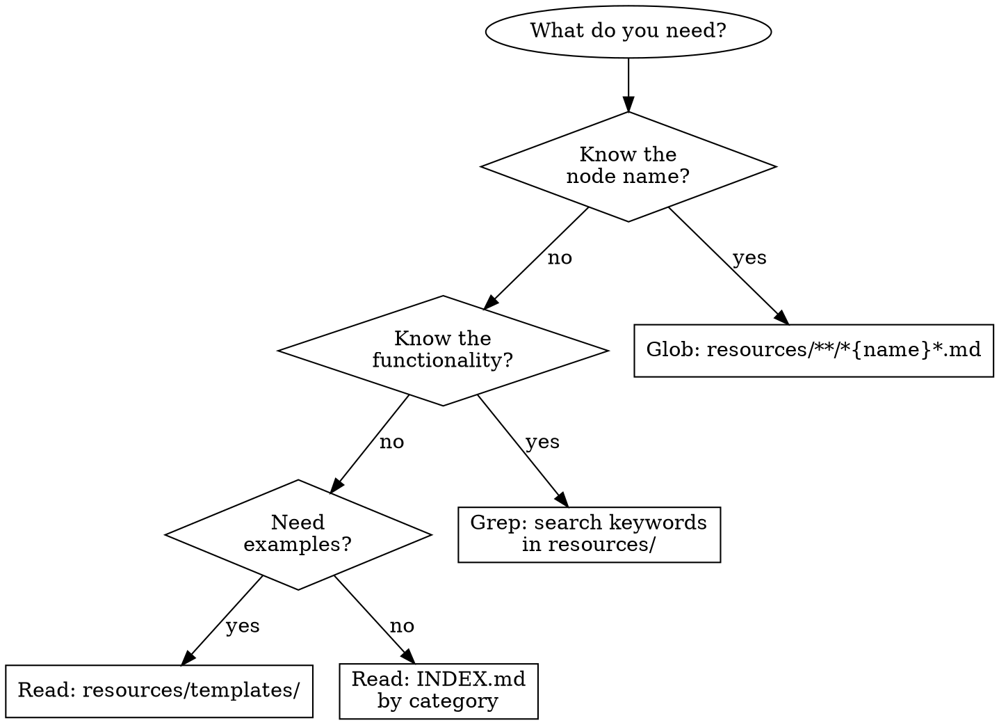

# Skill Design Improvements

Date: 2026-01-18
Status: Approved

## Overview

根據 writing-skills 最佳實踐審查後，對 n8n-skills 專案的 skill 設計進行全面改善，提升 CSO（Claude Search Optimization）、token 效率和使用體驗。

## Goals

1. 修改 description 為「Use when...」格式，符合 CSO 最佳實踐
2. 新增 When to Use、Quick Navigation、Common Mistakes 區塊
3. 將 workflow patterns 移至 guides/ 目錄，減少 SKILL.md token 消耗
4. 在 INDEX.md 新增快速任務對照表
5. 新增多環境使用指引（Claude Code / Claude.ai Web / Claude Desktop）
6. 加入決策流程圖（graphviz dot 格式）

## Files to Modify

| 檔案 | 修改內容 |
|------|----------|
| `src/generators/skill-generator.ts` | 修改 description、新增 When to Use、Common Mistakes、決策流程圖、移動 workflow patterns |
| `src/generators/resource-generator.ts` | 修改 INDEX.md 生成邏輯，新增快速任務對照表 |

## Design Details

### 1. SKILL.md New Structure

```
---
name: n8n-skills
description: "Use when building or troubleshooting n8n workflows. Covers node discovery, configuration details, connection compatibility, and workflow patterns."
license: MIT
metadata:
  author: Frank Chen
  version: "2.2.0"
---

# n8n Workflow Automation Skill Pack

## Overview
（微調現有內容）

## When to Use （新增）
- 使用情境清單
- 不適用情境

## Quick Navigation （新增）
- 決策流程圖（graphviz dot 格式）
- Quick Links

## Common Mistakes （新增，精簡版 4 個）
- 表格格式

## Resources
- 連結到各指南文件
- 連結到 INDEX.md

## License and Attribution
（保持不變）
```

### 2. New Description (CSO Optimized)

```
Use when building or troubleshooting n8n workflows. Covers node discovery, configuration details, connection compatibility, and workflow patterns.
```

### 3. When to Use Section

```markdown
## When to Use

Use this skill when:
- Building or designing n8n workflows
- Searching for nodes that match specific functionality
- Troubleshooting node configurations or connections
- Understanding node input/output compatibility
- Exploring community packages for extended functionality

Do NOT use when:
- Learning general automation concepts (use n8n official docs)
- Deploying or hosting n8n (infrastructure questions)
- Pricing or licensing questions (contact n8n directly)
```

### 4. Quick Navigation with Decision Flowchart

```markdown
## Quick Navigation

Use this flowchart to find the right resource:



### Quick Links

- [Complete Node Index](resources/INDEX.md) - All 545 nodes with line numbers
- [How to Find Nodes](resources/guides/how-to-find-nodes.md) - Search strategies
- [Usage Guide](resources/guides/usage-guide.md) - Detailed instructions
- [Workflow Patterns](resources/guides/workflow-patterns.md) - Common patterns
```

### 5. Common Mistakes (Compact Version)

```markdown
## Common Mistakes

| 錯誤 | 解決方案 |
|------|----------|
| 直接讀取整個 merged 檔案（數千行） | 使用 INDEX.md 查找行號，用 offset/limit 精確讀取 |
| 混淆 Trigger 和 Action 節點 | Trigger 只能放在工作流程開頭，Action 可放在任何位置 |
| 忽略節點相容性 | 查閱 compatibility-matrix.md 確認節點間可否連接 |
| 使用錯誤的節點命名格式 | 檔案格式為 `nodes-base.{nodeType}.md`，nodeType 通常是 camelCase |

See [Usage Guide](resources/guides/usage-guide.md#common-pitfalls) for more details.
```

### 6. INDEX.md Quick Task Reference

```markdown
## Quick Task Reference

| 任務 | 推薦節點 | 檔案位置 |
|------|----------|----------|
| 發送 HTTP 請求 | HTTP Request | input/nodes-base.httpRequest.md |
| 條件判斷分流 | IF | transform/nodes-base.if.md |
| 合併多筆資料 | Merge | transform/nodes-base.merge.md |
| 執行自訂程式碼 | Code | transform/nodes-base.code.md |
| 發送電子郵件 | Gmail | output/nodes-base.gmail.md |
| 接收 Webhook | Webhook | trigger/nodes-base.webhook.md |
| 定時排程執行 | Schedule Trigger | trigger/nodes-base.scheduleTrigger.md |
| AI 對話處理 | AI Agent | transform/transform-merged-2.md (line 171) |
| 讀寫 Google Sheets | Google Sheets | output/nodes-base.googleSheets.md |
| 資料格式轉換 | Set | transform/nodes-base.set.md |
```

### 7. Multi-Environment Usage Guide

```markdown
## 5. Multi-Environment Usage

This skill works across different Claude environments:

### Claude Code (CLI)
- Full file system access via Read, Glob, Grep tools
- Use offset/limit for precise reading
- Example: `Read("resources/INDEX.md", offset=50, limit=100)`

### Claude.ai Web
- No direct file access
- Request node information conversationally
- Example: "Tell me about the HTTP Request node configuration"
- Claude will reference skill knowledge to answer

### Claude Desktop (with MCP)
- File access depends on MCP server configuration
- If filesystem MCP enabled: same as Claude Code
- Otherwise: same as Claude.ai Web

### Usage Recommendations

| 環境 | 建議方式 |
|------|----------|
| Claude Code | 直接使用工具讀取檔案，效率最高 |
| Claude.ai Web | 描述需求，讓 Claude 從知識庫回答 |
| Claude Desktop | 確認 MCP 設定後選擇適合的方式 |
```

### 8. Workflow Patterns File (New)

Move existing `COMMON_PATTERNS` content from SKILL.md to `resources/guides/workflow-patterns.md`.

SKILL.md only keeps a link:
```markdown
## Resources

- [Workflow Patterns](resources/guides/workflow-patterns.md) - 6 common patterns
- [Complete Template Library](resources/templates/README.md) - 20 popular templates
- [Node Index](resources/INDEX.md) - All 545 nodes
```

## Implementation Steps

1. 修改 `src/generators/skill-generator.ts`
   - 更新 `DEFAULT_CONFIG.description`
   - 新增 `generateWhenToUse()` 方法
   - 新增 `generateQuickNavigation()` 方法
   - 新增 `generateCommonMistakes()` 方法
   - 新增 `generateResources()` 方法
   - 新增 `generateWorkflowPatternsFile()` 方法
   - 修改 `generate()` 方法的區塊順序
   - 更新 `generateUsageGuideFile()` 加入多環境說明和完整版 Common Mistakes
   - 更新 `generateHowToFindNodesFile()` 加入決策流程圖

2. 修改 `src/generators/resource-generator.ts`
   - 在 `generateUnifiedIndex()` 中新增快速任務對照表

3. 修改 `scripts/build.ts`（如需要）
   - 確保 workflow-patterns.md 被正確生成

4. 執行 `npm run build:full` 驗證輸出

## Expected Output Changes

- `output/SKILL.md`: 減少約 50 行（移除 workflow patterns），新增約 40 行（新區塊）
- `output/resources/INDEX.md`: 新增約 15 行（快速任務對照表）
- `output/resources/guides/workflow-patterns.md`: 新檔案（約 80 行）
- `output/resources/guides/usage-guide.md`: 新增約 40 行（多環境說明 + 完整版 Common Mistakes）
- `output/resources/guides/how-to-find-nodes.md`: 新增約 20 行（決策流程圖）

## Success Criteria

1. `npm run build:full` 成功執行
2. 輸出檔案結構正確
3. description 以「Use when...」開頭
4. 決策流程圖正確渲染
5. 所有連結可正常存取
